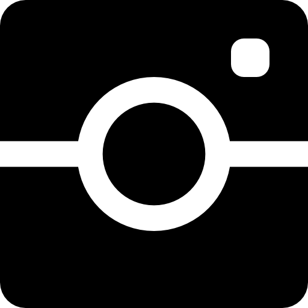

### < Hello World! 🖖 >  

I'm Thays, the girl in the pic beside! 👈 And now we’re free from the curse, you can *follow the blind* at links below! 🧙‍🖤   

  

<a target="_blank" href="mailto:thayscosta3@gmail.com">
   
</a>
 

I am a **brazilian web development student**, crazy about **books & comicbooks** 📚 💭 and **heavy metal music**.🤘 In my free time, I love to **read and write** about my readings, watch **movies or series** 📺 🧛‍  and listen to music, specially **metal and it’s subgenres** 🎶🤘 
  
I'm **excited to explore this whole new worlds** until the final frontier, in the continuing mission to explore strange new worlds. To seek out new life and new civilizations. **To boldly go where no one has gone before!** *Ops, I guess these are the voyages of the starship Enterprise.* But anyway, I feel like a explorer and I intent to reach some new worlds too!  

---

### Languages and Tools:  

<code></code>
<code></code>
<code></code>
<code></code>
<code></code>
<code></code>
<code></code>
<code></code>
<code></code>

---

### Stats

  

  ReadMe stats by 
  <a target="_blank" href="https://github.com/anuraghazra/github-readme-stats"> @anuraghazra</a>

---
